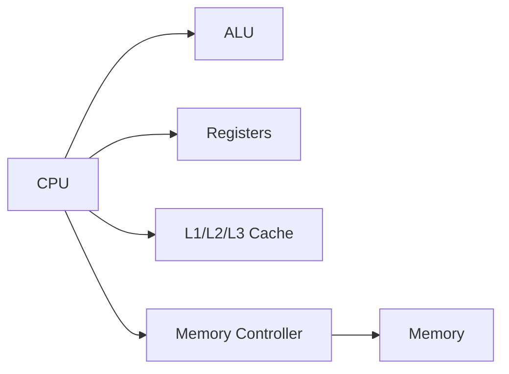
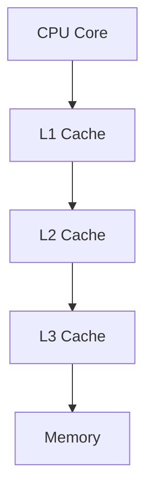
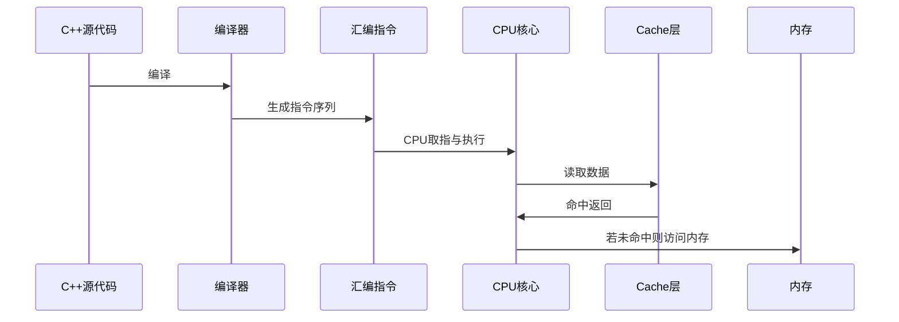

# CPU 体系结构与服务架构成本优化指导文档

## 一、文档目的
本指导文档旨在帮助后端/服务端开发人员深入理解 CPU 的基本体系结构，并能够将这些知识应用到日常服务性能分析与成本优化中。在阅读后，开发者应能够：
- 理解 CPU 的核心结构与执行机制；
- 分析自身服务在 CPU 上的瓶颈点；
- 制定针对性的性能优化方案；
- 降低整体服务运行成本，提高资源利用率。

---

## 二、CPU 体系结构核心概念

### （示意图）CPU 基本结构示例

理解 CPU 体系结构是分析服务性能的第一步。本节将从架构角度介绍 CPU 如何执行程序、哪些组件影响性能，以及在高并发服务场景下会体现出哪些瓶颈。

### 1. CPU 基本构成
- **ALU（算数逻辑单元）**：执行加减乘除、逻辑运算等基本操作。
- **寄存器（Registers）**：CPU 内部高速存储单元，存放临时数据与指令指针。
- **Cache（缓存）**：多级高速缓存（L1/L2/L3），用于减少访问内存的延迟。
- **内存控制器（Memory Controller）**：负责 CPU 与内存之间的数据传输。
- **多核架构**：现代 CPU 多由多个核心组成，可并行执行任务。

### 2. 指令流水线（Pipeline）

#### （示意图）指令在流水线中的流动

CPU 为提高执行效率，会采用指令流水线，将取指、译指、执行等步骤并行化。其性能瓶颈包括：
- **分支预测失败**导致流水线冲刷；
- **指令依赖性**导致停顿；
- **执行单元冲突**导致无法并行。

### 3. CPU Cache 原理

#### （示意图）Cache 层级结构

CPU Cache 是服务性能最容易受影响的关键点：
- L1/L2 Cache 速度极快，但容量很小；
- L3 Cache 容量大但速度较慢；
- Cache 命中率直接影响服务性能；
- 跨核访问（NUMA）可能导致延迟显著增加。

### 4. 多核与 NUMA 架构
现代服务器普遍采用多 CPU、多 NUMA 节点结构：
- 不同 NUMA 节点的内存访问延迟有差异；
- 跨节点调度线程或访问内存会显著影响性能；
- 服务需要“就近访问”与“绑定 CPU”。

---

## 三、CPU 维度的服务瓶颈分析方法

### 1. 使用 CPU 指标初步判断瓶颈
可关注以下指标：
- **CPU 使用率（User/System/Idle）**；
- **上下文切换（Context Switch）**；
- **CPU Load** 是否超过核心数 2 倍；
- **进程/线程调度延迟**；
- **运行队列长度（RunQueue）**。

### 2. 工具链使用指导
- **top / htop**：查看整体负载情况；
- **pidstat**：查看进程的 CPU 使用情况；
- **perf / flamegraph**：定位热点函数、锁竞争、指令序列热点；
- **async-profiler**：低开销 CPU、内存、锁分析；
- **numactl**：查看和设置 NUMA 策略。

### 3. 常见 CPU 相关瓶颈分析示例
- **函数热点集中** → 算法复杂度高或死循环
- **大量系统调用** → IO 密集导致 Kernel CPU 高
- **高上下文切换** → 线程过多或锁竞争严重
- **NUMA Miss 频繁** → 跨节点访问内存
- **Cache Miss 升高** → 数据结构或访问模式不友好

---

## 四、服务端常见 CPU 优化方向

### （示意图）C++ 程序执行数据流示例

### 1. 优化算法与数据结构
- 避免 O(n²) 级别的复杂操作；
- 优化大对象遍历；
- 使用更 cache-friendly 的数据结构，例如连续内存结构（Array > LinkedList）。

### 2. 降低锁竞争
- 避免过多全局锁（mutex）与读写锁；
- 使用 lock-free 数据结构；
- 减少共享状态，提高线程局部性；
- 微服务拆分降低共享资源冲突。

### 3. 控制线程数量
- 线程过多会导致调度成本指数增加；
- 线程池大小需根据 CPU 核数设置；
- CPU 密集型任务推荐线程数 = 核数 ± 1。

### 4. 提升 Cache 利用率
- 连续访问内存提高命中率；
- 避免大对象或稀疏访问；
- 避免频繁跨线程共享数据；
- 调整数据结构使其紧凑。

### 5. NUMA 优化
- 绑定进程与线程到固定 NUMA 节点；
- 采用 numactl 做进程级别绑定；
- 降低 Remote Memory 访问率。

### 6. 合理使用异步与批处理
- 异步能够减少线程阻塞；
- 批处理能减少系统调用与上下文切换；
- 适合高 QPS 服务的吞吐提升。

### 7. 系统参数调优
- 调整 scheduler、TCP 参数、文件描述符限制等；
- 针对 CPU 敏感型服务进行内核参数优化。

---

## 五、从 CPU 视角制定成本优化方案

### 1. 找到瓶颈并量化问题
- 明确 CPU 使用率最高的模块；
- 通过 flamegraph 定位最热的 5% 函数；
- 明确锁竞争、算法复杂度或 NUMA 问题是否显著。

### 2. 制定服务优化策略
- 若 CPU 主要用于业务逻辑 → 优化代码；
- 若 CPU 主要用于系统调用 → 优化 IO；
- 若 CPU 时间耗在锁等待 → 拆服务 / 优化锁；
- 若 CPU 在跨节点访问 → 优化 NUMA 绑定策略。

### 3. 评估优化收益（成本预估）
需回答：
- 每减少 10% CPU 能节省多少机器？
- 是否能支撑业务高峰不扩容？
- 代码优化带来的收益是否明显？

---

## 六、开发人员行动清单（Checklist）

✔ 检查服务热点函数和调用链
✔ 使用 flamegraph 分析 CPU 使用比例
✔ 检查锁、线程数量、调度开销
✔ 检查 NUMA 分布情况（numastat）
✔ 优化数据结构减少 Cache Miss
✔ 控制线程池大小
✔ 监控 CPU 使用、系统调用、上下文切换

---

## 七、总结
CPU 是服务性能分析中最核心的资源。本指导文档从 CPU 架构、性能瓶颈分析方法、典型优化手段到成本优化策略进行了系统介绍。若开发人员能够将本文内容融入日常开发与调优工作，相信可以有效提升服务性能、降低计算成本，提高整体业务稳定性与扩展能力。

